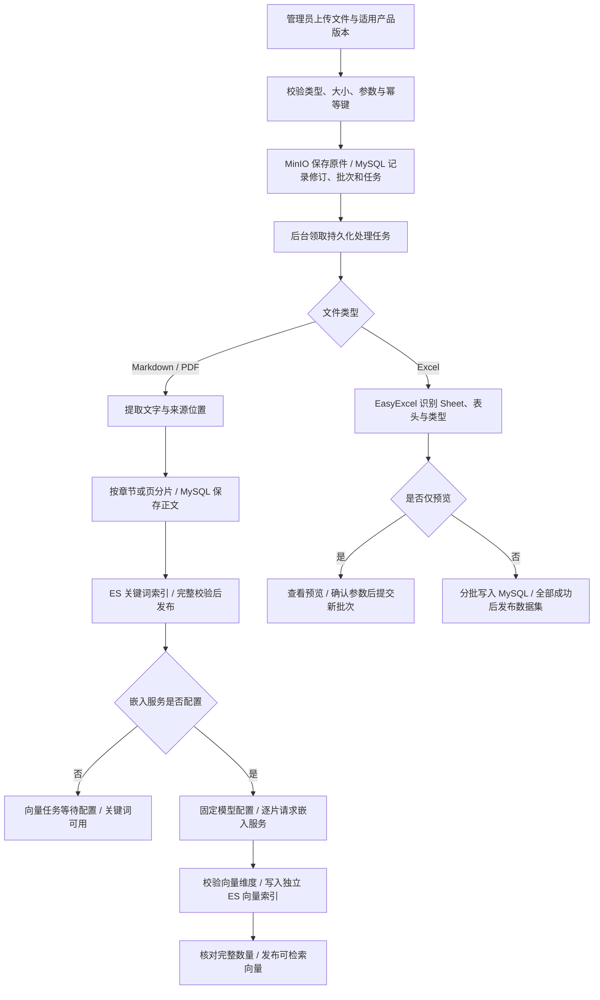
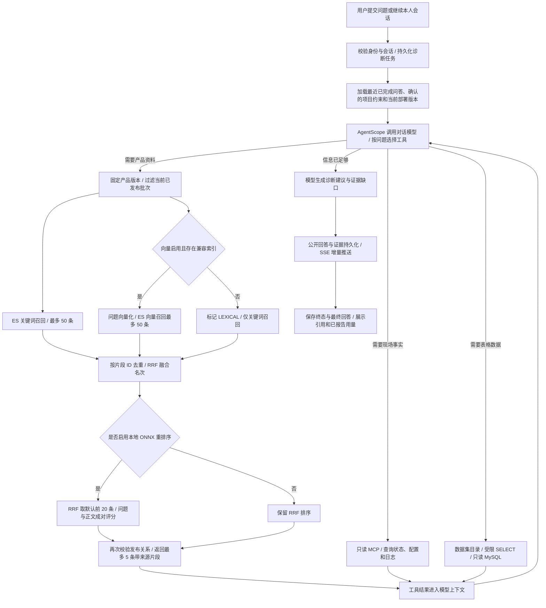
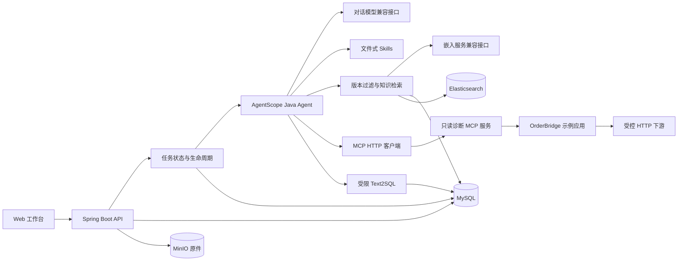

# SupportOps

**面向软件实施与技术支持人员的 Java Agent 诊断工作台。**

把现场报障、产品文档和只读诊断工具连接起来，形成带来源的事实、候选原因、人工处理建议和证据缺口。主要用于工单受理之后、研发深入处理之前的初步排查。

首版为可本地运行的诊断示例：一个 Agent、一个 Java 订单同步环境、四个只读 MCP 工具。完整工单、复杂权限、自动修复、多 Agent 和技能市场见 [版本路线图](ROADMAP.md)。

> 模型诊断需要自行配置兼容接口的服务密钥。未配置时，应用提供文档管理、关键词检索和故障环境操作，并明确显示诊断不可用。固定协议测试用于验证工程链路，不代表真实模型诊断准确率。

## 典型问题

“升级到 2.0 后订单同步持续失败，路径配置看起来没有变化。”

实施人员需要核查的是这个产品在这个现场的事实：当前版本读取哪个配置键、实际生效值是什么、失败请求访问哪个路径、下游返回什么，以及迁移说明是否适用。SupportOps 用 MCP 获取当前事实，用适用的资料解释产品行为；诊断助手提出建议，由人员处理，再用新的请求验证结果。

## 功能

| 模块 | 当前实现 |
| --- | --- |
| Agent | AgentScope Java 单 Agent，多轮工具调用；百炼、DeepSeek、OpenAI 与自定义兼容接口按配置选择 |
| Harness | 异步任务、默认最多 10 轮和 120 秒超时、主动取消、终态保护与重启中断标记 |
| MCP | Streamable HTTP，四个固定的只读诊断工具 |
| 文档 | Markdown、文字型 PDF、Excel 上传；单文件最多 20 MiB，原件存入 MinIO，保留上传、修订和处理历史，自定义分片与重叠 |
| 检索 | Elasticsearch 关键词与向量召回、RRF 初筛、可选本地 ONNX 模型精排、服务端版本过滤；Excel 使用 MySQL 只读 Text2SQL |
| 后台处理 | Java 21 虚拟线程、持久化任务、状态与进度、租约恢复、失败定时补偿和人工重试 |
| Skills | 两个内置文件式排障 Skill，按需加载，不开放脚本执行 |
| 项目记忆 | 人员显式确认的项目约束；跨会话加载、查看和删除 |
| 用量分析 | 输入／输出堆叠柱状图、累计与每轮平均用量折线图、高消耗会话图；保留 UTC 小时／天明细、Token Top 20、历史问答与执行证据回看，区分未报告用量 |
| 用户 | 首次创建管理员、密码登录和退出；管理员创建账号；普通用户仅访问自己的对话；诊断与上传记录保存用户归属 |
| 工作台 | SSE 流式回答、Markdown 渲染、证据分类、历史诊断、会话逻辑归档、JSON 导出、模型配置和示例环境操作 |
| 验证 | HTTP/MCP 集成测试、任务生命周期测试、六个场景及批量评测脚本 |

诊断、文档片段、上传与修订历史、任务状态和项目约束通过 MyBatis-Plus 保存在 MySQL。Excel 各 Sheet 使用独立的带类型关系表，原件保存在 MinIO 私有桶，文本和向量索引保存在 Elasticsearch。示例应用使用内存状态，重启后恢复为默认升级故障；正在执行的诊断标记为中断，知识处理任务按持久化租约恢复。

## 快速启动

需要 JDK 21、Node.js 22+、已启动的 Docker Engine / Docker Desktop，以及 Docker Compose 2.20+。项目包含 Maven Wrapper，首次构建和拉取镜像需要联网；网页运行本身不依赖 Node.js。

根目录 [docker-compose.yml](docker-compose.yml) 一次启动 MySQL、MinIO、Elasticsearch 三项依赖，默认回环端口为 13306、19000、19200；Java 应用在本机运行。环境要求、依赖用途、完整操作步骤、端口调整和故障排查见 [本地部署与启动依赖](docs/deployment.md)。

首次启动时，应用会自动创建业务表、索引和必要的初始数据，无需手动导入 SQL。启动完成后，打开工作台创建管理员账号即可使用。已有数据库的版本升级、手动初始化或历史数据导入，请参阅 [数据库维护](docs/database.md)。

推荐构建 JAR 后通过 Node 脚本启动，以加载 `.local/model.env`。以下快速启动跳过测试；完整验证需先准备独立测试依赖，见下方“测试与评测”。

Windows PowerShell：

```powershell
# 确保 JAVA_HOME 指向 JDK 21。
docker compose up -d --wait --wait-timeout 180
node scripts/setup-local.mjs
.\mvnw.cmd -s .mvn/settings.xml -DskipTests package
node scripts/start.mjs
```

macOS / Linux：

```bash
docker compose up -d --wait --wait-timeout 180
node scripts/setup-local.mjs
sh ./mvnw -s .mvn/settings.xml -DskipTests package
node scripts/start.mjs
```

`setup-local.mjs` 创建匹配 Compose 的 `.local/model.env`，已有文件会保留。默认关闭向量与本地重排序，无需模型密钥即可首次启动。公开合成存储账号只用于本机演示；完整配置项另见 [.env.example](.env.example)。

打开 [本地工作台](http://127.0.0.1:18080)，按页面引导创建首个管理员；已有账号时进入登录页。没有预置默认密码。业务数据位于上述存储服务；本地模型设置、运行日志和评测报告位于 `.local/`，该目录不纳入版本控制。停止应用使用终端的 Ctrl+C，停止依赖使用 `docker compose stop`，数据卷保留。

侧栏按场景分为“客户工作区”和“后台管理”：诊断工作台、新建会话与最近诊断位于客户工作区；知识文档、项目约束、示例环境、用量分析、模型配置及用户管理位于后台管理。管理员可访问全部菜单并创建账号；普通用户仅可使用客户工作区并查看自己的对话。操作与权限见 [用户系统](docs/users.md)。

`node scripts/start.mjs` 使用独立 JAR 副本，避免占用构建产物。开发调试也可使用 Maven `spring-boot:run`，但它不读取 `.local/model.env`，数据库与存储等参数必须另行设置为进程环境变量。

### 后端接口文档

应用内置 [Swagger UI](http://127.0.0.1:18080/swagger-ui/index.html)，覆盖已实现的业务接口，按业务模块分组，提供中文用途、请求参数、响应字段、枚举含义、错误码和调用示例。业务接口统一使用 GET 查询、POST 执行写操作。查看文档不需要模型密钥。

Swagger 与 OpenAPI 定义仅管理员登录后可访问。机器可读定义位于 [OpenAPI JSON](http://127.0.0.1:18080/v3/api-docs) 和 [OpenAPI YAML](http://127.0.0.1:18080/v3/api-docs.yaml)。调用顺序、状态处理和密钥说明见 [后端接口文档](docs/api.md)。

### 配置模型

管理员在侧边栏打开“模型配置”，选择服务商，填写接口地址与 API 密钥，点击“获取可用模型”选择准确的模型 ID（也可手动填写），按需设置对话推理等级，点击保存即可生效，无需修改配置文件或重启。对话与向量服务分别保存，内置百炼、DeepSeek、OpenAI 与自定义兼容接口。诊断运行期间不能修改配置。

界面配置优先于文件与环境变量，保存在 `.local/model-settings.json`；其中的密钥未加密，不会回显到页面，不应共享或提交该目录。切换服务商或接口地址后需填写对应密钥，旧密钥不会沿用。“恢复文件配置”可删除当前角色的界面覆盖值。

文件配置适用于脚本运行和高级参数：`.local/providers.yml` 保存服务商定义，`.local/model.env` 保存本地环境变量。示例见 [.env.example](.env.example) 和 [providers.example.yml](providers.example.yml)。

**向量服务为可选配置。** 启动应用、上传与分片文档、关键词检索、项目记忆管理均不要求模型密钥。普通 Agent 诊断和默认关键词评测只要求对话密钥；建立向量索引及混合检索评测才要求向量密钥。未配置向量服务时，普通检索明确使用 `LEXICAL`，不会因此阻止诊断。

例如，使用 DeepSeek 对话并禁用向量服务，在 `.local/model.env` 中设置：

```dotenv
SUPPORTOPS_MODEL_PROVIDER=deepseek
DEEPSEEK_API_KEY=填写本地密钥
SUPPORTOPS_EMBEDDING_PROVIDER=disabled
```

选择 OpenAI 时使用 `SUPPORTOPS_MODEL_PROVIDER=openai` 与 `OPENAI_API_KEY`；选择百炼时使用 `bailian` 与 `DASHSCOPE_API_KEY`。只填写实际使用的平台密钥，切换 Provider 不会回退读取另一平台的密钥。原有 `SUPPORTOPS_API_KEY` 等覆盖变量仍可使用；切换时应清除不再适用的旧地址、模型和密钥覆盖值。

工作台启动脚本与评测脚本都会读取 `.local/model.env`，直接通过 Java 或 Maven 启动时需要自行设置进程环境变量。应用自动加载 `.local/providers.yml`，文件修改后重启生效。默认评测使用界面配置快照，显式指定 `--config` 的评测使用独立文件配置。自定义 Provider、参数兼容性与完整示例见 [模型服务配置](docs/providers.md)。

当前对话适配器使用 Chat Completions 的流式响应与工具调用；嵌入请求发送至 `/embeddings`。接口兼容性不等于覆盖所有模型特性，Responses 与 Anthropic Messages 协议尚未实现。运行结果及所检索的片段会进入模型上下文；建立索引时，文档片段会发送给配置的嵌入服务。

### 演示一次完整排查

1. 在“知识文档”中选择“导入示例文档”，导入 2.0 运行手册、迁移说明和 1.0 历史手册。
2. 等待文档解析和关键词索引完成。已配置嵌入服务时自动建立向量索引；未配置时显示等待处理条件，关键词检索仍可用。
3. 在“示例环境”选择“升级后配置未迁移”。系统会实际发起 HTTP 请求并记录失败响应。
4. 在诊断工作台使用“升级后订单同步失败”的示例问题，查看工具调用、参考片段及建议。
5. 审阅后，在“示例环境”由人员执行“应用 2.0 路径配置”，检查新的业务请求是否返回 200。
6. 回到诊断页补充“已调整配置，请重新验证”，生成新的诊断记录。

该环境由本项目自建，订单、凭据和下游均为合成演示数据。MCP 只返回实际状态与请求记录，不返回场景名称或预设根因。切换故障、修改配置和发起业务同步均未作为工具开放给 Agent。

## 知识检索的作用

通用模型能够解释 HTTP 状态、Java 异常和常见配置问题。本项目的知识库补充产品专属规则：不同版本读取哪个键、默认值是什么、旧规则何时失效，以及怎样验证迁移结果。

### 文件上传到向量化



1. **受理与留存。** 上传记录保存请求归属、内容摘要和幂等键，原件保存在 MinIO 私有桶；MySQL 维护逻辑文档、不可变修订、处理批次和任务。HTTP 受理成功只表示进入处理流程。
2. **解析与分片。** Markdown 按标题、文字型 PDF 按页提取，再按 Unicode 码点窗口分片。默认上限 `chunkSize=100`、重叠 `overlap=10`，可在上传或重新处理时调整；重叠不跨章节或页。分片记录正文、文档及修订 ID、页码或行区间，尚不支持 OCR。
3. **先提供关键词检索。** 分片和 TEXT 任务在同一事务提交；后台写入 ES，完整校验后更新 MySQL 发布关系。解析成功、关键词可用和向量可用分别显示，上传完成不等于向量化完成。
4. **按配置生成向量。** 向量任务固定服务地址与模型配置，逐片生成并校验向量，写入按配置指纹和维度区分的 ES 索引；数量完整且当前发布关系仍匹配时才发布。缺少配置时仅向量阶段等待；服务调用失败会记录错误，按任务规则阻塞或重试，不发布部分索引。
5. **独立处理 Excel。** Excel 保留 Sheet、列类型、修订和原始行号，走关系表与受限 SQL 查询。预览批次不可查询；确认后提交正式处理批次，全部入表成功后发布，不经过文本向量化。

重新处理保留历史修订与批次；删除文档立即停止检索，再由后台清理外部存储，历史诊断证据不改写。参数、补偿与发布规则见 [知识存储与处理](docs/knowledge.md)。

### 用户提问到检索、重排序与返回



1. **确定上下文。** 每轮诊断创建独立 Agent，续聊加载最近三轮已完成问答和当前人工确认的项目约束。知识与 Excel 工具使用服务端固定的部署版本；适用资料为该版本或通用标记 `*`。
2. **按需取证。** Agent 根据问题选择 MCP、知识检索、Excel 查询与 Skill 加载，可多轮组合调用。并非每个问题都需要检索；Skill 和检索内容不能扩大工具权限。
3. **召回与融合。** 文本检索先过滤当前发布批次与版本，关键词始终参与；向量配置有效且有兼容已发布索引时，另将问题向量化并执行向量召回。两路各最多 50 条，按片段 ID 合并，用 RRF（常数 60）融合名次。无兼容向量时明确返回 `LEXICAL`；进入向量调用后的失败明确报错。
4. **可选重排序。** 开启 ONNX 时，RRF 先保留默认 20 条候选，本地模型对“问题＋片段正文”成对评分。关闭时直接沿用 RRF 顺序。两种路径都在返回前重新检查发布关系，最多提供 5 条片段；`score` 保留 RRF 分数，`rerankScore` 保存模型原始分数，二者都不是诊断置信度。`lexicalOnly` 只关闭向量召回，不关闭已启用的重排序；精排失败也不会静默回退。
5. **生成与交付。** 模型综合现场事实、资料片段、表格结果和项目约束，形成事实、候选原因、人工建议与缺口。引用保留文档、分片、修订、批次及原文位置；普通用户通过证据快照查看片段，原件管理入口仅管理员可用。执行期间公开回答和事件经 SSE 推送，结束后以持久化终态与最终回答为准；重连按游标续接，不重新执行诊断。

模型输出、工具调用和检索证据可交错产生；流程图表示数据依赖，实际执行允许多轮取证。模型文件、排序预算和错误说明见 [本地重排序](docs/reranking.md)，任务生命周期见 [架构说明](docs/architecture.md)。

关键词命中、向量相似度和引用存在都不等于结论正确。诊断效果需要在同模型、同资料与同预算下进行对照，并审阅引用是否真正支持结论。

## 与通用 Agent 的关系

资料齐全的一次性排障，直接使用通用 Agent 是合理选择。为其提供相同的文档、MCP 和 Skills，它也可能完成本项目的任务。

SupportOps 的价值在于把技术支持流程落成固定工作台：预接入现场证据、约束资料版本、保存诊断记录、复用项目约束，并用可复现环境验证执行边界。它不以“模型比通用 Agent 更聪明”为定位，也没有据此宣称诊断效果更优。

企业形态下，统一工单、人员交接、项目隔离和质量追踪可以继续扩展；这些能力属于后续路线图。当前版本用于本地演示和工程验证。

## 架构



采用模块化单体，Agent 任务运行在 Java 虚拟线程中，独立于提交任务的 HTTP 请求。工作台通过 SSE 增量接收持久化回答片段和执行证据，断线后按事件游标续接；历史记录仍可通过查询接口读取。参考资料和日志不具备指令权限；只读工具范围由服务端注册表固定。

技术版本固定在 [pom.xml](pom.xml)：Java 21、Spring Boot 3.5.16、MyBatis-Plus 3.5.17、AgentScope Java 2.0.2、与其对齐的 MCP SDK 0.17.0，以及 PDFBox 3.0.5。业务模块内部采用 Controller、Service、Mapper 分层，数据库实体与请求、响应对象分别维护。内部模块、持久化方式和任务语义见 [架构说明](docs/architecture.md)，代码修改规范见 [AGENTS.md](AGENTS.md)。

## 测试与评测

```powershell
.\mvnw.cmd -s .mvn/settings.xml verify

# 诊断页面时序、评测检查与失败处理测试（需要 Node.js）。
node --test src/test/js/*.test.mjs
```

测试前按 [隔离依赖说明](docs/deployment.md#隔离测试与评测) 启动测试用 MySQL、MinIO 和 ES。测试创建独立随机数据库、桶和索引，覆盖真实持久化、旧 H2 迁移、Excel 类型与只读 SQL、分片、补偿、版本发布以及诊断生命周期。模型响应与向量使用本地 HTTP 协议夹具；它们不读取真实模型密钥，不用于计算模型诊断准确率。

批量评测入口自动分配本机端口和新的数据库，保留原始报告，并在结束后停止本次创建的应用进程。运行前先执行 Maven `verify` 生成 JAR。

```powershell
# 仅检查故障条件与版本检索，不调用模型服务。
node scripts/evaluate.mjs --sources-only

# 默认读取界面模型配置快照；也可使用文件配置，规则见评测说明。
# 六个真实诊断案例，使用关键词检索。
node scripts/evaluate.mjs

# 相同案例分别使用关键词、混合检索，共十二次诊断。
# 对话和嵌入服务均需要配置；两组实验各自使用新的数据库。
node scripts/evaluate.mjs --compare
```

六个场景为下游不可用、凭据错误、配置迁移、历史文档不适用、证据不足与文档干扰。每次结果写入 `.local/evaluation/<本次运行>/`：`report.json` 保存执行状态、诊断、完整事件、资料与程序指纹、耗时及服务报告的 Token；`review.md` 提供诊断、引用原文与人工判定表。所选评测组缺少必需模型配置时输出 `NOT_RUN`；来源检查不要求模型密钥。

自动检查仅覆盖环境与部分边界，诊断、引用和注入抵抗效果需要按 [评测说明](evaluation/README.md) 人工审阅；没有检索到攻击材料时不能判定注入测试通过。

已执行检查的范围与结果见 [验证结果与范围](docs/validation.md)。

## 使用边界

- 默认仅监听本机，检查浏览器来源和请求主机；提供管理员与普通用户账号权限；没有租户隔离或企业授权体系。
- 单一可变示例环境同时只接受一个诊断任务；运行期间阻止工作台更改故障条件。
- 项目记忆在任务开始时读取。删除只影响之后启动的任务，历史诊断不因此改写。
- 上传与重建异步执行；单文件最大 20 MiB、PDF 最多 500 页、文本最多 10000 个分片。Excel 最多 20 个选中 Sheet、200 列、100000 个非空行（含表头），并限制展开后的单元格与字符量。复杂表头需显式指定，公式必须有已保存的缓存值。
- 模型建议需要人工审阅。当前版本没有自动修复、工单状态机或生产环境连接器。

## 文档导航

全部文档按使用、原理和维护分类，见 [文档目录](docs/README.md)。

| 内容 | 文档 |
| --- | --- |
| 部署、依赖与故障排查 | [本地部署与启动依赖](docs/deployment.md) |
| 定位、使用环节与范围 | [产品说明](docs/product.md)、[版本路线图](ROADMAP.md) |
| 数据处理与检索原理 | [知识存储与处理](docs/knowledge.md)、[本地重排序](docs/reranking.md)、[架构说明](docs/architecture.md) |
| 配置与接口 | [模型服务](docs/providers.md)、[用户系统](docs/users.md)、[API](docs/api.md) |
| 数据库初始化与历史升级 | [数据库维护](docs/database.md) |
| 验证与评测 | [验证结果与范围](docs/validation.md)、[场景评测](evaluation/README.md) |

## 许可证

本项目采用 [Apache License 2.0](LICENSE)。
