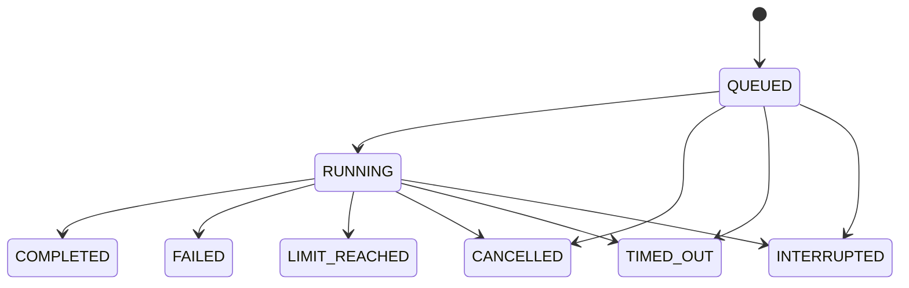

# SupportOps 架构说明

## 模块与边界

| 模块 | 职责 |
| --- | --- |
| `agent` | AgentScope 适配、异步任务、上下文组装、事件与终态持久化、SSE、会话归档与用量分析 |
| `mcp` | 固定四个只读工具，通过 Streamable HTTP 提供服务 |
| `demo` | 生成实际 HTTP 交互的 Java 示例应用与受控下游 |
| `knowledge` | 文档解析、分片、索引事务、版本筛选和检索 |
| `memory` | 人员确认的单项目约束，显式写入和删除 |
| `api` | 本地来源、登录认证与角色接口边界、统一错误响应 |
| `user` | 两类账号、密码验证、初始化事务与公开资料 |
| `config` | Provider 注册、独立的对话与向量路由、凭据引用和请求参数兼容性 |

模型只能接触注册的四个 MCP 工具、知识检索、Excel 数据集目录及只读 SQL 查询、Skill 加载工具。不存在执行命令、任意地址请求、写配置或写记忆工具。Excel 查询不允许指定数据库、物理表或部署版本。工作台的示例操作接口与模型工具注册分离。

## 代码分层与持久化

业务模块内部按职责组织代码：`controller` 处理 HTTP 请求与响应，`service` 声明业务边界，`service/impl` 负责流程与事务，`mapper` 访问数据库，`entity` 对应数据库表，`dto` 和 `vo` 分别承载传输参数与公开响应。`constant` 集中维护状态和业务限制。配置类及协议适配器保持独立职责，不为没有持久化的模块创建空 Mapper。

```text
agent/       controller · service/impl · service/support · mapper · entity · dto · vo · constant · memory
knowledge/   controller · service/impl · service/support · mapper · entity · dto · vo · constant
memory/      controller · service/impl · mapper · entity · dto · vo · constant
demo/        controller · service/impl · dto · vo
config/      controller · dto · vo · 配置与路由组件
api/         vo · 来源检查与统一异常处理
mcp/         MCP 传输和只读工具注册
user/        controller · service/impl · mapper · entity · dto · vo · 身份与密码组件
migration/   H2 离线迁移与隔离评测存储管理入口
```

`agent/memory/ConversationTurn` 表达一次已完成问答；顶层 `memory` 模块保存人员确认的项目约束。`DocumentParser` 处理正文提取与分片，`ElasticKnowledgeIndex` 封装 ES 协议，`ReadOnlySqlCompiler` 校验并重建 SELECT，`AgentEventRecorder` 合并模型流式事件。

数据层使用 MyBatis-Plus 的 Spring Boot 3 Starter。常规 CRUD 使用实体 `BaseMapper` 和类型安全的 Lambda Wrapper；连接、聚合、动态 Excel 表与条件查询保留在 Mapper/XML/受控 SQL Provider 内。数据库实体不直接作为公开响应，SQL 值使用参数绑定，动态标识符仅来自服务端生成的命名规则。

服务层通过 `TransactionTemplate` 明确事务范围：原件网络写入、文本解析、模型与 ES 调用均在短事务之外；完整分片和后续任务共同提交。Excel DDL/批次插入写入未发布表，全部 Sheet 成功后发布。向量暂存可部分写入，检索只使用全量校验后的 MySQL 发布指针。USAGE 事件与诊断用量共同提交。状态更新保留旧状态、租约和执行令牌条件。

MySQL 由应用内置 Flyway 自动初始化并维护增量版本，已应用的脚本不改写。显式离线工具 `migration/H2ToMysqlMigration` 可读取旧 H2 数据，保留历史 ID、正文、事件和用量，转换文档修订并登记重新索引任务；旧向量需重建，缺失原件标记为 `MISSING`。完整结构、手动初始化和历史接管见 [数据库维护](database.md)。

诊断创建与人工环境操作通过 `RunService.whenIdle` 使用相同的准入锁。Controller 不持有持久化 Mapper，也不自行管理事务或同步锁。

模型服务由 `ProviderRegistry` 解析。未选择的 Provider 不要求密钥，向量配置不会阻止关键词诊断。AgentScope 对话适配器和嵌入客户端各自取得所选路由；任务事件记录不含密钥的路由描述与生成参数。配置使用范围和优先级见 [模型服务配置](providers.md)。

侧边栏“模型配置”通过本地接口保存两个角色的覆盖值。`LocalModelSettings` 以原子文件替换持久化配置，成功后发布不可变快照；版本标记阻止过期页面覆盖新值。配置修改与任务创建共用运行锁，诊断活跃时返回冲突。恢复文件配置只删除指定角色的界面覆盖值。每次文档建索引或检索固定一份向量端点快照，避免过程中切换配置造成向量与模型标识不一致。

## 任务状态



提交请求先持久化任务，再交给虚拟线程执行。每个任务拥有独立的 Agent 和 MCP 客户端；一次诊断结束后关闭资源。终态采用互斥保护，取消或超时后的迟到成功、异常和工具事件不能覆盖终态。

执行期间，工具、检索结果与公开回答片段逐条入库。浏览器通过 SSE 接收带事件游标的快照，连接断开不会取消或重跑任务。新模型轮次重置回答草稿，最终完成后以任务 answer 为准；失败、取消和超时可以从事件恢复未完成草稿，并明确标记。仅接收公开文本事件，不记录思维事件。Token 使用量按模型报告事件累计，失败与取消保留已经收到的计量；供应商未报告时无法得到完整用量。限步约束作用于 Agent 推理轮数，同一轮可能调用多个工具，不等于精确的模型请求数或费用上限。

本地单环境只允许一个活动任务。任务准入和人工环境变更共享互斥边界，避免检查空闲与修改状态之间出现竞争。取消后等待执行资源退出，才允许下一次环境变更。

流式连接在读取首个快照前注册提交信号，事件事务提交或任务状态落库后非阻塞唤醒连接，取消固定间隔的数据库轮询。每个连接最多积压一个唤醒信号，事件内容仍通过持久化游标读取；空闲时每 15 秒发送 SSE 注释心跳，断线、超时和终态均清理订阅。页面按浏览器绘制帧合并片段更新，保留问题、回答和已成形 Markdown 块的节点，只解析末尾未完成块；终态完整解析一次，校准后置引用定义等跨块语义。

进程重启时，将尚处于 QUEUED/RUNNING 的任务标记为 INTERRUPTED。恢复会话只重建最多三轮已完成的问答；不重放工具，不承诺恢复到模型中断的位置。历史内容不替代当前现场查询。

`runId` 标识一轮诊断，`sessionId` 关联多轮问答；每次提交仍创建独立 Agent。续聊只加载最近三轮 COMPLETED 问答，每轮历史回答最多 5000 字符，再读取当前人工确认的项目约束。普通用户只能读取本人诊断，管理员可回看全部记录；任何账号都不能在他人会话中追加诊断。

归档按整个 `sessionId` 在事务中锁定并更新 `runs.archived_at`，执行中的对话拒绝归档。最近列表仅返回最多 100 条未归档诊断，历史详情、事件、用量统计与会话排行继续保留归档数据；重复归档幂等，已归档会话不能续聊。它不改变诊断终态，也不提供恢复入口。具体权限见 [用户系统](users.md)。

## 文档索引与检索

`DocumentLibraryServiceImpl` 作为文档库门面，受理上传、维护历史、分派任务和组织清理。`DocumentImportServiceImpl` 执行 IMPORT 阶段，负责原件解析、Excel 入表和文本分片提交；`DocumentIndexServiceImpl` 执行 TEXT/VECTOR 阶段，负责 ES 写入、模型快照、断点补偿与完整性验证。两者通过 `DocumentRevisionService` 共享文档可见性、原件读取和发布指针规则，依赖方向不回到文档库门面。

`KnowledgeWorker` 只负责调度、并发容量、心跳和中断；`KnowledgeTaskServiceImpl` 维护任务租约、进度、执行历史及重试预算。阶段服务在原有短事务中检查文档锁和租约，外部模型、MinIO 和 ES 请求不进入这些事务。具体代码入口见 [知识处理代码导航](knowledge.md#代码导航)。

逻辑文档、不可变修订、解析批次、发布指针分别建模。产品版本与递增修订号互不替代；同修订重分片产生新批次。Markdown 按标题层级、PDF 按页提取，再按 Unicode 码点窗口分片；默认 100/10，可在上传或重处理时指定。窗口为每片上限，重叠不跨章节或 PDF 页；历史迁移未记录的参数对外返回空值。片段保存标题路径、页/行区间、区块内起止偏移、顺序及摘要，引用绑定确切修订与批次。

上传先登记记录并写 MinIO，随后在同一 MySQL 事务建立修订、批次和 IMPORT 任务。Java 虚拟线程完成解析后，文本链路依次创建 TEXT 和 VECTOR 任务。任务每分钟补偿扫描，默认并发 2，租约 120 秒，心跳 30 秒；失效租约可重新领取。自动尝试最多 5 次（含首次），按 1/5/15/60 分钟加抖动退避，配置问题进入 BLOCKED，人工重试开启新预算并保留历史。应用重启不依赖内存队列恢复。

ES 关键词使用 BM25、中文 `cjk` 分词和配置键/错误码精确字段；向量使用 `dense_vector` kNN。两路召回先过滤适用产品版本（精确或 `*`）和 MySQL 当前发布批次，向量额外过滤完整任务代；应用以 RRF（常数 60）融合名次。启用本地模型重排序时默认初筛 20 条，由 ONNX 对问题与正文成对评分，按模型分数返回最多 5 条；最终返回前再次核对可见批次。RRF 分数保留，模型 logits 单独记录，二者都不是诊断置信度。配置与资源边界见 [本地重排序](reranking.md)。

索引绑定服务基础地址、模型及维度。配置不匹配的索引不参与向量召回；只要存在匹配的已发布向量代，就对该集合做向量召回，并保留全量适用文本的关键词召回。无可用向量时明确返回 LEXICAL；已经进入向量调用后发生异常不能静默回退。供应商在相同模型名称下改变实现时需要重新建索引。

ES 稳定 ID 与外部版本号防止补偿重复写入及旧尝试覆盖新尝试。关键词、向量分别全量校验后发布，新修订失败保留旧发布结果。删除先在 MySQL 取消任务、移除发布指针，再由持久化清理任务回收 ES、MinIO 和 Excel 物理表。已保存的修订、分片与任务历史保留。

Excel 使用 EasyExcel 两遍流式读取：先推断表头、类型及样例，再按 500 行分批入表。每个 Sheet 对应一张生成名称的 MySQL 关系表，保留原始行号和原表头映射。预览不建物理表。Text2SQL 工具先读取已发布目录，生成 SQL 后由 JSQLParser AST 白名单重建；只允许单表 SELECT，参数绑定、固定查询上限、3 秒执行提示及 5 秒驱动超时，并使用只有 Excel 数据域 SELECT 权限的独立连接池。明细带原始行号，汇总带 SQL 口径、Sheet 和来源修订。

## 记忆与证据

项目记忆只接受显式确认的输入，每条最多 1000 字符、最多 30 条。它是用户约束的持久化，不负责自动抽取历史经验或推测根因。每次任务独立读取当前记忆列表，并记录加载的记忆 ID。

文档和工具结果保留在该任务的事件快照中。删除源文档或记忆不会改写历史诊断。新会话不加载已删除记忆；同一会话的既有问答仍可能提及历史约束，因此不能把会话记录当成当前约束的权威来源。

系统不保存内部思维过程。对外错误采用固定错误码，故障定位事件只保留异常类型及代码位置，不保存供应商错误正文。

## 本地部署边界

MySQL 承载业务事实，MinIO 承载原件，ES 承载可重建的关键词和向量索引。示例应用状态位于内存，业务请求实际访问本机临时端口下游。自建场景定义和评测标准只属于操作者和评测脚本，不通过 MCP 或默认知识库提供给模型。

来源检查与本机监听只适用于本地演示。当前两类账号权限见 [用户系统](users.md)。部署到企业环境仍需要项目授权、数据保留策略与连接器授权，不能仅更改监听地址就视为企业可用。

## 用量分析

后台管理提供“用量分析”：默认最近 7 个 UTC 日期，支持最多 90 天范围、按天或小时统计，以及会话累计输入与输出 Token 的 Top 20 排行。排行合并同一会话在所选范围内的诊断轮次；回看展示该会话全部历史，按 50 轮分页，包含提问、最终回答、状态、耗时、输入和输出 Token，并可打开原任务的执行证据。

统计按诊断创建时间归属，UTC = 北京时间减 8 小时；不是请求发生时刻的计费账单。包含执行中、失败、取消等状态的已报告用量，不包含向量服务用量或费用。没有 USAGE 事件的轮次单独计数，零值不代表没有消耗；已有用量事件也不保证覆盖全部调用。完成状态仅表示执行结果，回答质量仍需结合问答与证据人工审阅。

复用 runs 的 session_id、question、answer、时间、状态和累计 Token，以及 run_events 的 USAGE 事实。用户问题在受理时保存，最终回答在终态保存，公开回答片段与工具证据保存在事件表；用量事件和累计值在同一事务内写入。无需新增表、清空数据库或回填虚构计量，旧记录直接纳入查询。对话记录包含提交用户 user_id；当前排行仍按会话聚合，由管理员查看，不记录内部思维。
