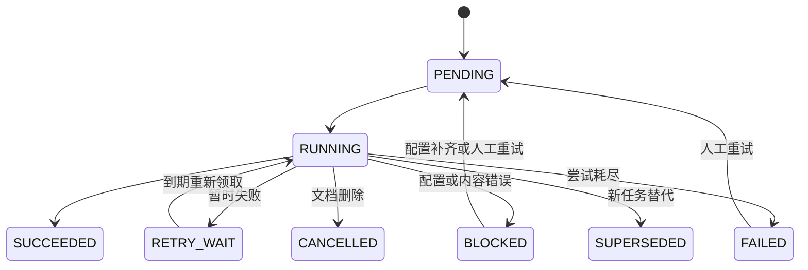

# 知识存储与处理

## 存储职责与配置

MySQL 是业务事实来源，保存文档、分片、任务、发布关系及 Excel 数据；MinIO 保存不可变原件；Elasticsearch 保存可重建的关键词和向量索引。环境版本、配置模板、启动命令与端口统一见 [本地部署与启动依赖](deployment.md)，手动初始化及旧 MySQL / H2 数据处理见 [数据库维护](database.md)。

业务账号拥有业务库 CRUD / Flyway DDL 和 Excel 数据域建表、入表权限；独立查询账号仅有 Excel 数据域 SELECT 权限。MinIO 桶保持私有，应用通过确切修订的原件接口返回文件流；ES 可配置用户名和密码，非本机地址要求 HTTPS。外部存储仍需自行准备数据库、账号与授权，Compose 仅提供本机演示配置。

| 环境变量 | 用途 |
| --- | --- |
| `SUPPORTOPS_DB_URL/USER/PASSWORD` | MySQL 业务连接 |
| `SUPPORTOPS_EXCEL_SCHEMA` | Excel 物理表所在数据库，默认 `supportops_excel` |
| `SUPPORTOPS_EXCEL_QUERY_USER/PASSWORD` | 独立只读查询身份 |
| `SUPPORTOPS_MINIO_ENDPOINT/ACCESS_KEY/SECRET_KEY/BUCKET` | 原件存储连接及私有桶 |
| `SUPPORTOPS_ES_ENDPOINT/USER/PASSWORD/PREFIX` | ES 连接及本应用索引前缀 |

### 导入示例资料

管理员在“知识文档”点击“导入示例文档”，或携带登录 Cookie 与 `X-SupportOps-Request: 1` 调用 `POST /api/documents/import-examples`。受理后等待关键词处理成功再检索，向量状态独立展示。

命令行也可运行 `node scripts/import-knowledge.mjs`。先在进程环境中设置 `SUPPORTOPS_USERNAME`、`SUPPORTOPS_PASSWORD` 为已创建的管理员账号；地址由 `SUPPORTOPS_URL` 指定，默认 `http://127.0.0.1:18080`，只接受本机 HTTP 根地址。账号变量不写入模型配置文件，不通过命令行参数传密码。PowerShell 可用 `Read-Host -AsSecureString` 读取密码后临时传给子进程，使用结束后移除环境变量。

脚本登录后携带 Cookie 与写请求头，通过正式示例接口导入，等待关键词处理成功后退出并注销本次会话；普通导入不要求向量配置。加 `--index` 时先检查向量配置，再按当前配置提交向量重建并等待成功。配置存在不代表远程鉴权成功；处理失败或超时返回非零退出码，不自动重试写请求，已受理任务保留在工作台。批量评测仍使用 `scripts/evaluate.mjs` 的独立实例。

## 代码导航

上传链路按“受理 → 解析入库 → 关键词同步 → 向量同步 → 发布”组织。业务接口仍从文档库门面进入，后台任务的执行权由持久化租约控制。

| 职责 | 代码入口 | 关键步骤 |
| --- | --- | --- |
| 上传与文档管理 | [DocumentLibraryServiceImpl](../src/main/java/io/supportops/knowledge/service/impl/DocumentLibraryServiceImpl.java) | `submit` 依次调用登记、校验、重复处理复用、原件保存和 `acceptUpload`；`execute` 分派任务 |
| 解析与入库 | [DocumentImportServiceImpl](../src/main/java/io/supportops/knowledge/service/impl/DocumentImportServiceImpl.java) | `importBatch` 区分 Excel 和文本；`saveChunksAndScheduleText` 原子保存分片与 TEXT 任务 |
| ES 与向量编排 | [DocumentIndexServiceImpl](../src/main/java/io/supportops/knowledge/service/impl/DocumentIndexServiceImpl.java) | `indexText` 写入并发布关键词；`indexVector` 固定模型、复用已有写入、核对数量并发布向量 |
| 修订与发布规则 | [DocumentRevisionServiceImpl](../src/main/java/io/supportops/knowledge/service/impl/DocumentRevisionServiceImpl.java) | `requireDocument` 检查可见性及按需锁定；`original` 读取确切原件；`publish` 防止发布回退 |
| 正文分片 | [DocumentParser](../src/main/java/io/supportops/knowledge/service/support/DocumentParser.java) | `parsePdf` 按页处理；`markdown` 识别围栏外标题；`split` 计算码点窗口与原文行区间 |
| 外部协议 | [EmbeddingClient](../src/main/java/io/supportops/knowledge/service/EmbeddingClient.java)、[ElasticKnowledgeIndex](../src/main/java/io/supportops/knowledge/service/ElasticKnowledgeIndex.java) | 模型请求及向量校验；ES mapping、Bulk 动作与正文、刷新与数量核对 |
| 调度与补偿 | [KnowledgeWorker](../src/main/java/io/supportops/knowledge/service/KnowledgeWorker.java)、[KnowledgeTaskServiceImpl](../src/main/java/io/supportops/knowledge/service/impl/KnowledgeTaskServiceImpl.java) | 定时／即时领取、虚拟线程、续租；条件更新、尝试记录、失败分类和退避时间 |

解析和索引服务不反向依赖文档库门面。修订服务参与调用方已有的事务，不能将发布移动到独立事务，否则文档锁、任务租约和发布指针将失去共同保护。向量在 ES 中可以暂存部分成功结果，只有完整性校验通过且发布关联提交后才参与检索。

## 上传、修订与发布

单文件最多 **20 MiB（20971520 字节）**，multipart 请求最多 25 MiB。支持 UTF-8 Markdown、文字型 PDF、XLS 和 XLSX。扫描 PDF 没有 OCR。PDF 最多 500 页，文本最多 10000 个分片。

上传先保存原件及上传记录，再受理后台任务。`ACCEPTED` 不是文档已可检索；上传记录的 `SUCCEEDED` 表示解析/入表成功，关键词和向量结果使用独立状态表示。失败、重复、补传和历史迁移均保留上传事实；在 multipart 解析之前被服务器拒绝的超大请求没有进入业务受理流程，不会产生上传编号。

| 数据层次 | 含义 |
| --- | --- |
| 逻辑文档 `documents` | 一份长期维护的资料，删除标记与内容去重入口 |
| 上传 `document_uploads` | 每次请求、幂等键/载荷摘要、原件、修订和受理结果 |
| 原件 `source_files` | 对象键、文件名、媒体类型、字节数、SHA-256、保存状态 |
| 修订 `document_versions` | 递增修订号、产品适用版本、标题快照、说明、原件关系 |
| 批次 `document_batches` | 同一修订的解析代次、参数快照及摘要、解析器版本、行数/片数、三类处理状态 |
| 分片 `chunks` | 稳定 ID、修订/批次/顺序、正文及摘要、标题层级、页/行范围、区块内码点偏移与字数 |
| 发布 `document_releases` | 每份逻辑文档及产品版本当前可引用的修订、批次和完整向量任务 |
| 任务/尝试 `knowledge_tasks`、`knowledge_attempts` | 执行阶段、进度、模型配置指纹、维度、租约、重试预算及每次结果 |
| Excel 元数据 `excel_datasets`、`excel_columns` | Sheet、原表头、受控列名、类型、格式提示、样例和物理表注册 |

`productVersion` 表示资料适用的产品版本，`revision` 表示资料修订次数。相同内容与产品版本的重复导入可复用文档；上传新修订必须指定 `documentId`，不按文件名推断归属。相同 `requestKey` 及载荷返回同一上传记录，载荷不同返回 409。网络响应不确定时复用该键核对，确认失败后再使用新键。

重新分片保留原修订，新建处理批次。新批次关键词或 Excel 数据完整可用后才更新发布指针；新向量任务完整校验后才替换向量指针。旧任务不能让发布指针退回较低修订或代次。历史引用记录确切文档、分片、修订和批次，原件入口为 `/api/documents/versions/{versionId}/original`，PDF 可附 `#page=页码`。

## 分片与 ES 检索

`chunkSize` 默认 100，范围 100–8000；`overlap` 默认 10，非负，且 `chunkSize - overlap >= 10`。单位为 Unicode 码点，中文和补充字符不会按 UTF-16 半字符截断。`chunkSize` 是上限：章节末片或短章节可以更短；同一章节内的相邻片段实际重叠 `overlap` 个码点。Markdown 先按标题、PDF 按页划分，重叠不跨这些源区块；行号描述来源区间，精确偏移相对于该区块。分片详情显示每片实际字数。

已有正常批次沿用其真实配置，不会因修改默认值而改写。H2 迁移批次未记录真实参数，接口的 `chunkSize` 和 `overlap` 返回 `null`，页面显示“参数未记录”；迁移占位值不作为执行事实展示。恢复摘要完全一致的原件后，以 100/10 创建新批次并重建索引，成功发布后使用新结果，原批次和引用仍保留。

ES 文本索引同步标题、文件名、产品版本、修订号、文档/原件/批次/分片 ID、正文、标题路径、页/行/码点位置、摘要及配置键/错误码。正文使用中文 `cjk` 分词，标识字段使用 `keyword`，关键词通过 BM25 召回，向量使用 `dense_vector` kNN。向量索引名称包含模型配置指纹和维度，任务 ID 区分重建代。

两路检索都预先过滤 MySQL 当前发布批次和适用版本；向量只查询已发布且匹配当前配置的任务。应用按 RRF 融合名次，常数 60。返回前再次检查发布关系，避免网络调用期间已删除/替换的资料被返回。没有配置或没有兼容已发布向量时返回 `LEXICAL`；进入向量调用后的错误不会伪装成关键词成功。

## 本地模型重排序

启用时，RRF 初筛默认 20 条，再由本地 ONNX 模型精排，最终返回最多 5 条；仅关键词召回也可以精排。默认关闭，关闭时直接按 RRF 返回最多 5 条。启用后推理失败明确报错，不降级为 RRF。模型文件路径、输入预算、取消与超时、分数含义及真实模型测试见 [本地重排序](reranking.md)。

## Excel 与 Text2SQL

EasyExcel 4.0.3 使用两遍流式读取：先识别表头、列类型和少量样例，再按每批 500 行写 MySQL。每个选中 Sheet 使用一个服务端生成的物理表，查询端只看到逻辑表名 `data` 和 `c_0`、`c_1` 等列名；`source_row` 是一基原始行号。

支持文本、BIGINT、DECIMAL(38,10)、日期、日期时间和布尔类型；保留前导零编号、NULL 与精确小数。混合类型保守退为文本，类型可通过预览确认或重新导入覆盖。表头默认为各 Sheet 首个非空行，可指定一基行号；Sheet 选择使用零基序号。公式使用已保存缓存值，不执行公式；错误单元格和缺少缓存的公式明确拒绝。

容量上限为 20 个选中 Sheet、每 Sheet 200 列、累计 100000 个非空行（含表头）、2000000 个非空单元格、40000000 个展开字符；单元格最多 32767 字符。复杂多层/合并表头需整理或显式选择表头行；不推测业务主键及跨 Sheet 关联。

`preview=true` 只保存类型和样例，数据不能查询；确认后用 `preview=false` 创建新批次。`columnTypes` 的键为 `sheetIndex:columnIndex`，例如 `{"0:2":"DECIMAL"}`。完整入表后发布；任何类型或行数检查失败都不会替换旧可查询的数据代。

Agent 固定注册 `list_excel_datasets` 和 `query_excel`：先获取当前部署版本的已发布数据集，再由模型生成受限 SELECT，服务端校验后执行。支持单表筛选、排序、分页和 COUNT/SUM/AVG/MIN/MAX 等白名单函数。禁止多语句、JOIN、子查询、UNION、任意函数、用户变量、文件读写及锁定查询。用户 SQL 不直接执行，AST 被重建为受控 SQL，所有值参数绑定，物理标识符只来自注册元数据。

查询最多返回 200 行，额外探测一行后标记 `truncated`；最大 OFFSET 为 100000，SQL 最长 8000 字符。数据库执行提示上限 3 秒，驱动查询超时 5 秒。结果数值使用字符串传输，避免浏览器丢失整数或 DECIMAL 精度。明细自动补充 `source_row`；聚合结果引用修订、Sheet 和 SQL 查询口径，不伪造单行定位。诊断事件 `SQL_RESULT` 保存结构化结果供回答与历史核对。

## 状态与自动补偿

任务事实保存在 MySQL，内存只管理当前执行资源。调度器默认每 60 秒扫描，上传提交及任务完成会触发即时扫描；默认同时处理 2 个任务，在虚拟线程中执行外部 I/O。租约默认 120 秒，每 30 秒续租，单任务最长 30 分钟。过期执行者不能续租、提交分片或发布索引；重启后的扫描恢复到期任务。

暂时失败自动尝试最多 5 次，包含首次，后续按 1、5、15、60 分钟加少量抖动退避。每次尝试保留独立历史；人工重试不清空累计次数，而是开启新预算。配置缺失、鉴权及内容问题阻塞，避免无限请求；补齐原先缺失的向量配置后自动唤醒，其余问题修正后人工重试或重建。ES 稳定 ID、外部版本和已写向量检查支持幂等补偿，写入成功的片段无需重复生成。

任务参数位于 `supportops.knowledge.jobs`。扫描、并发、租约、心跳、超时和最大尝试数均可配置；调整时应让心跳间隔明显小于租约，并保留足够的外部请求时间。删除立即取消可见发布与未完成任务，等待已有租约和外部调用退出后清理存储；清理失败也进入相同补偿流程。

## 隔离测试与评测

按 [隔离部署步骤](deployment.md#隔离测试与评测) 启动测试用 MySQL、MinIO 和 ES，再运行 Maven 验证、JavaScript 测试及来源评测。它们创建随机数据库、桶和索引，不使用日常工作台数据；模型协议测试使用本地 HTTP 夹具，不证明外部鉴权或语义效果。

评测结束后停止自己启动的应用并清理本组存储，报告、资源名称、程序指纹与日志保留在 `.local/evaluation/`。若进程被强制结束，可通过 `runtime.json` 中的 `workspace` 核对遗留资源。真实模型配置和报告含义见 [评测说明](../evaluation/README.md)。

迁移工具和评测资源管理工具属于命令行基础设施，JDBC 仅在这些入口及测试独立核对中使用；应用业务服务通过 MyBatis-Plus Mapper 访问数据库。
